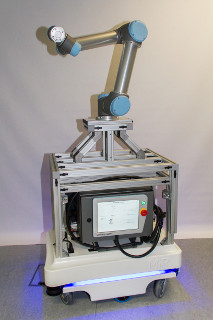

mobipick
========

[](https://git.ni.dfki.de/mobipick/mobipick/commits/kinetic)

This repo contains ROS configuration files (URDF description, Gazebo launch
files, MoveIt config, bringup launch files) for the Mobipick
robot (MiR 100 base, UR5 arm, Robotiq 2 Finger Gripper + Force-Torque Sensor,
Orbbec Astra Mini S 3D camera).




Package overview
----------------

* `mobipick_bringup`: Launch and configuration files for the real Mobipick robot
* `mobipick_description`: URDF description of the robot
* `mobipick_gazebo`: Simulation specific launch and configuration files
* `mobipick_moveit_config`: MoveIt! launch and configuration files
* `mobipick_pick_n_place`: Some demo nodes that show off the MoveIt capabilities of the robot


Installation
------------

```bash
# create a catkin workspace and clone all required ROS packages
mkdir -p ~/catkin_ws/src
cd ~/catkin_ws/src/
git clone -b kinetic git@git.ni.dfki.de:mobipick/mobipick.git
git clone -b master https://github.com/roboticsgroup/roboticsgroup_gazebo_plugins.git
git clone -b master https://github.com/JenniferBuehler/general-message-pkgs.git
git clone -b master https://github.com/JenniferBuehler/gazebo-pkgs.git

# use rosdep to install all dependencies (including ROS itself)
apt-get update -qq
apt-get install -qq -y python-rosdep
sudo rosdep init
rosdep update
rosdep install --from-paths ./ -i -y --rosdistro kinetic

# build all packages in the catkin workspace
source /opt/ros/kinetic/setup.bash
catkin_init_workspace
cd ~/catkin_ws
catkin_make -DCMAKE_BUILD_TYPE=RelWithDebugInfo
```

If you have a physical pico flexx camera attached to this PC, also follow the
installation instructions of the
[pico_flexx_driver](https://github.com/code-iai/pico_flexx_driver). These
cannot be integrated into the instructions above because they require a manual
download step.

In case you encounter problems, please compare the commands above to the build
step in [`.gitlab-ci.yml`](.gitlab-ci.yml); that should always have the most
recent list of commands.

You should add the following line to the end of your `~/.bashrc`, and then
close and reopen all terminals:

```bash
source ~/catkin_ws/devel/setup.bash
```

Quick start
-----------

The following examples describe how to use the robot in simulation. For more information on how to use the real mobipick robot have a look at the README.md in `mobipick_bringup`.

### Pick + Place demo (Gazebo)

```bash
roslaunch mobipick_gazebo mobipick_mrk_lab_world.launch
rosservice call /gazebo/unpause_physics   # or click the "start" button in the Gazebo GUI
roslaunch mir_gazebo fake_localization.launch __ns:="mobipick"
roslaunch mobipick_moveit_config moveit_planning_execution.launch use_pointcloud:=true simulation:=true __ns:="mobipick"
roslaunch mobipick_moveit_config moveit_rviz.launch config:=true   # not required, just for visualization
roslaunch mobipick_pick_n_place mobipick_pick_n_place.launch
```

[](https://vimeo.com/256064111)

(Click image to see video)


### Pick + Place demo (MoveIt! demo mode)

```bash
roslaunch mobipick_moveit_config demo.launch
roslaunch mobipick_pick_n_place mobipick_pick_n_place.launch object_source:=static
```

[](https://vimeo.com/256064108)

(Click image to see video)


### move_base demo (maze world)

```bash
roslaunch mobipick_gazebo mobipick_maze_world.launch
rosservice call /gazebo/unpause_physics   # or click the "start" button in the Gazebo GUI
roslaunch mir_gazebo fake_localization.launch delta_x:=-10.0 delta_y:=-10.0
# or alternatively: roslaunch mir_gazebo fake_localization.launch delta_x:=-10.0 delta_y:=-10.0
rosrun mobipick_gazebo move_arm_to_home
roslaunch mir_navigation start_planner.launch \
    map_file:=$(rospack find mir_gazebo)/maps/maze.yaml \
    virtual_walls_map_file:=$(rospack find mir_gazebo)/maps/maze_virtual_walls.yaml
rviz -d $(rospack find mir_navigation)/rviz/navigation.rviz
```

Now, you can use the "2D Nav Goal" tool in RViz to set a navigation goal for move_base.


### move_base demo (MRK lab world)

```bash
roslaunch mobipick_gazebo mobipick_mrk_lab_world.launch
rosservice call /gazebo/unpause_physics   # or click the "start" button in the Gazebo GUI
roslaunch mir_gazebo fake_localization.launch
rosrun mobipick_gazebo move_arm_to_home
roslaunch mir_navigation start_planner.launch \
    map_file:=$(rospack find mobipick_gazebo)/maps/rh5_mrk_lab.yaml \
    local_planner:=eband
rviz -d $(rospack find mir_navigation)/rviz/navigation.rviz
```

Now, you can use the "2D Nav Goal" tool in RViz to set a navigation goal for move_base.


### move_base demo (AVZ world)

```bash
roslaunch mobipick_gazebo mobipick_avz_world.launch
rosservice call /gazebo/unpause_physics   # or click the "start" button in the Gazebo GUI
roslaunch mir_gazebo fake_localization.launch delta_x:=-14.70 delta_y:=-15.0 delta_yaw:=-1.57
rosrun mobipick_gazebo move_arm_to_home
roslaunch mir_navigation start_planner.launch map_file:=$(rospack find uos_maps)/maps/avz5floor_gazebo.yaml local_planner:=eband
rviz -d $(rospack find mir_navigation)/rviz/navigation.rviz
```

Now, you can use the "2D Nav Goal" tool in RViz to set a navigation goal for move_base.


### Using the arm velocity controller

If you want to use the velocity controller for the arm, add
`arm_velocity_controller:=true` to any of the launch files, like so:

```bash
roslaunch mobipick_gazebo mobipick_table_world.launch arm_velocity_controller:=true
rosservice call /gazebo/unpause_physics   # or click the "start" button in the Gazebo GUI
```

Now you can send velocity commands to the arm directly, like this:

```bash
rostopic pub /arm_velocity_controller/command std_msgs/Float64MultiArray "data: [0.4, 0.1, -0.1, 0, 0, 0]"
```

In this configuration, MoveIt won't work however, since MoveIt requires the
joint trajectory controller instead of the velocity controller (because MoveIt
is a joint trajectory client).

You can switch to the arm trajectory controller like this:

```bash
rosrun controller_manager controller_manager stop arm_velocity_controller
rosrun controller_manager controller_manager start arm_controller
```

This also works the other way around, e.g. if you didn't add the
`arm_velocity_controller:=true` argument to the launch file:

```bash
rosrun controller_manager controller_manager stop arm_controller
rosrun controller_manager controller_manager start arm_velocity_controller
```

If you prefer a graphical interface, try this:

```bash
rosrun rqt_controller_manager rqt_controller_manager
```


Troubleshooting
------------

##### Error on "catkin_make -DCMAKE_BUILD_TYPE=Release install":

 ```bash
 /usr/lib/gcc/x86_64-linux-gnu/5/../../../x86_64-linux-gnu/libgazebo_ode.so: error: undefined reference to 'CProfileManager::Start_Profile(char const*)'
 /usr/lib/gcc/x86_64-linux-gnu/5/../../../x86_64-linux-gnu/libgazebo_ode.so: error: undefined reference to 'btLemkeAlgorithm::solve(unsigned int)'
 /usr/lib/gcc/x86_64-linux-gnu/5/../../../x86_64-linux-gnu/libgazebo_ode.so: error: undefined reference to 'CProfileManager::Stop_Profile()'
 collect2: error: ld returned 1 exit status
 gazebo-pkgs/gazebo_test_tools/CMakeFiles/cube_spawner.dir/build.make:186: recipe for target '/home/dfki.uni-bremen.de/dmronga/Workspace/catkin_ws/devel/lib/gazebo_test_tools/cube_spawner' failed
 make[2]: *** [/home/dfki.uni-bremen.de/dmronga/Workspace/catkin_ws/devel/lib/gazebo_test_tools/cube_spawner] Error 1
 CMakeFiles/Makefile2:8145: recipe for target 'gazebo-pkgs/gazebo_test_tools/CMakeFiles/cube_spawner.dir/all' failed
 make[1]: *** [gazebo-pkgs/gazebo_test_tools/CMakeFiles/cube_spawner.dir/all] Error 2
 make[1]: *** Waiting for unfinished jobs....
 ```

 * Workaround: Delete the gazebo_test_tools package

#####  Error on "roslaunch mobipick_gazebo mobipick_table_world.launch"

* Mobipick package is missing!
* Solution:

 ```bash
git clone git@git.ni.dfki.de:mobipick/mobipick.git
 ```

##### Error on "roslaunch mobipick_gazebo mobipick_table_world.launch"

 ```bash
 ERROR: cannot launch node of type [joint_state_publisher/joint_state_publisher]: joint_state_publisher
 ROS path [0]=/opt/ros/kinetic/share/ros
 ROS path [1]=/home/dfki.uni-bremen.de/dmronga/Workspace/catkin_ws/src
 ROS path [2]=/opt/ros/kinetic/share
 ```
 * Tried the following:

 ``` bash
 cd ~/catkin_ws/src
 rosdep install --from-paths ./ -i -y --rosdistro "kinetic"
 ```
 * got the following error:

 ```bash
 ERROR: the following packages/stacks could not have their rosdep keys resolved
 to system dependencies:
 mobipick_pick_n_place: Cannot locate rosdep definition for [vision_msgs]
 ```

 * Solution:

 ```bash
 cd ~/catkin_ws/src
 sudo rosdep init
 rosdep update
 rosdep install --from-paths ./ -i -y --rosdistro "kinetic"
 ```


##### Error on "roslaunch mobipick_gazebo mobipick_table_world.launch"

```bash
[rqt_joint_trajectory_controller-13] process has died [pid 30256, exit code 1, cmd /opt/ros/kinetic/lib/rqt_joint_trajectory_controller/rqt_joint_trajectory_controller __name:=rqt_joint_trajectory_controller __log:=/home/dfki.uni-bremen.de/dmronga/.ros/log/0b98ae40-3d82-11e8-a99f-f46d04cef46e/rqt_joint_trajectory_controller-13.log].
log file: /home/dfki.uni-bremen.de/dmronga/.ros/log/0b98ae40-3d82-11e8-a99f-f46d04cef46e/rqt_joint_trajectory_controller-13*.log
```

The log file then says:

```bash
qt_gui_main() found no plugin matching "rqt_joint_trajectory_controller"
```

* Solution (from [here](https://answers.ros.org/question/91231/rqt-plugin-not-listedfound-in-list-returned-by-rqt-list-plugins/?answer=91386#post-id-91386)):

```bash
rm ~/.config/ros.org/rqt_gui.ini
```


##### Errors related to missing packages

```bash
[ERROR] [1523449370.789220962]: Could not load controller 'gripper_controller' because controller type 'position_controllers/JointTrajectoryController' does not exist.
[ERROR] [1523449370.789260021]: Use 'rosservice call controller_manager/list_controller_types' to get the available types
```

... or:


```bash
[Err] [Plugin.hh:165] Failed to load plugin libgazebo_ros_control.so: libgazebo_ros_control.so: cannot open shared object file: No such file or directory
```

... or:

```bash
[ERROR] [1531143358.907155735]: Could not load controller 'arm_controller' because controller type 'velocity_controllers/JointTrajectoryController' does not exist.
[ERROR] [1531143358.907247601]: Use 'rosservice call controller_manager/list_controller_types' to get the available types
```

* Solution:

 ```bash
 sudo apt-get install ros-kinetic-joint-trajectory-controller
 sudo apt-get install ros-kinetic-gazebo-ros-control 
 sudo apt-get install ros-kinetic-joint-trajectory-controller
 ```

 or better: Add an `exec_depend` to the `package.xml` of the package that uses the missing package (e.g., `mobipick_description`), and then:

 ```bash
 rosdep update
 rosdep install -i --from-paths .
 ```
