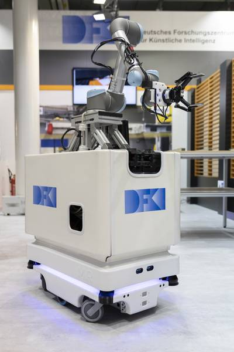

mobipick
========

[](https://git.hb.dfki.de/mobipick/mobipick/commits/kinetic)

This repo contains ROS configuration files (URDF description, Gazebo launch
files, MoveIt config, move_base config, bringup launch files) for the Mobipick
robot (MiR 100 base, UR5 arm, Robotiq 2 Finger Gripper + Force-Torque Sensor,
Orbbec Astra Mini S 3D camera).




Package overview
----------------

* `mobipick_description`: URDF description of the robot
* `mobipick_gazebo`: Smulation specific launch and configuration files
* `mobipick_moveit_config`: MoveIt! launch and configuration files
* `mobipick_navigation`: move_base launch and configuration files
* `mobipick_pick_n_place`: Some demo nodes that show off the MoveIt capabilities of the robot


Installation
------------

See the build step in [`.gitlab-ci.yml`](.gitlab-ci.yml).


Quick start
-----------

### Pick + Place demo (Gazebo)

```bash
roslaunch mobipick_gazebo mobipick_table_world.launch
rosservice call /gazebo/unpause_physics   # or click the "start" button in the Gazebo GUI
roslaunch mobipick_gazebo fake_localization.launch
roslaunch mobipick_moveit_config moveit_planning_execution.launch use_pointcloud:=true
roslaunch mobipick_moveit_config moveit_rviz.launch config:=true   # not required, just for visualization
roslaunch mobipick_pick_n_place mobipick_pick_n_place.launch
```

[](https://vimeo.com/256064111)

(Click image to see video)


### Pick + Place demo (MoveIt! demo mode)

```bash
roslaunch mobipick_moveit_config demo.launch
roslaunch mobipick_pick_n_place mobipick_pick_n_place.launch object_source:=static
```

[](https://vimeo.com/256064108) 

(Click image to see video)
